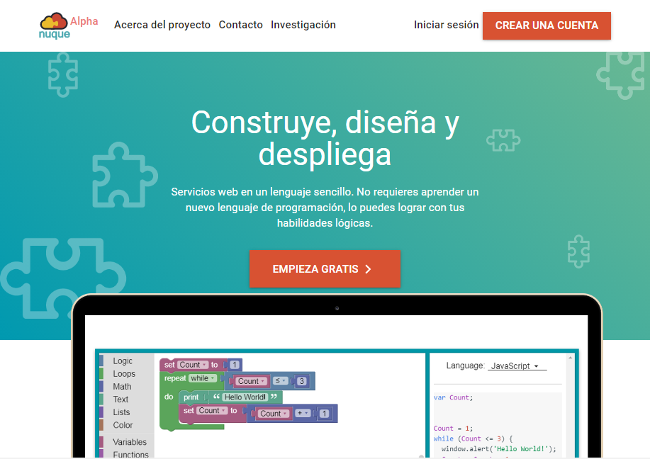
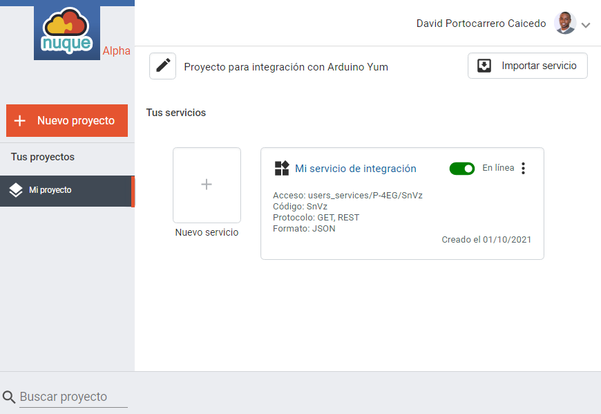
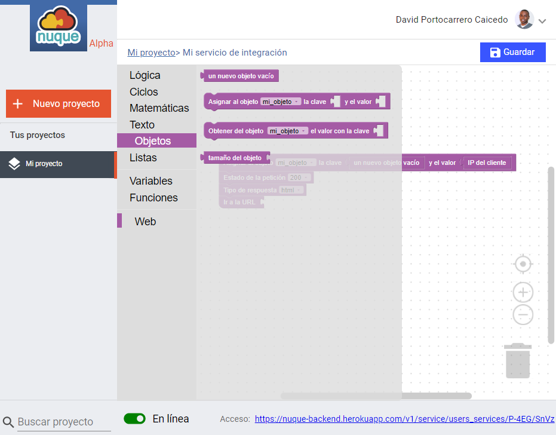

# Nuque - Master Graduation Project

Build micro-services using a block-besed language to programming server logic and deploy on live.

## Installation
Using the terminal jump into `nuque-dashboard` folder and run the follow command:

```bash
$ npm start
```

Insted, you want to use the development enviroment just run the follow command in the terminal

```bash
$ npm run dev
```

### Screenshots





## Access

> [https://nuque-dashboard.herokuapp.com](https://nuque-dashboard.herokuapp.com)